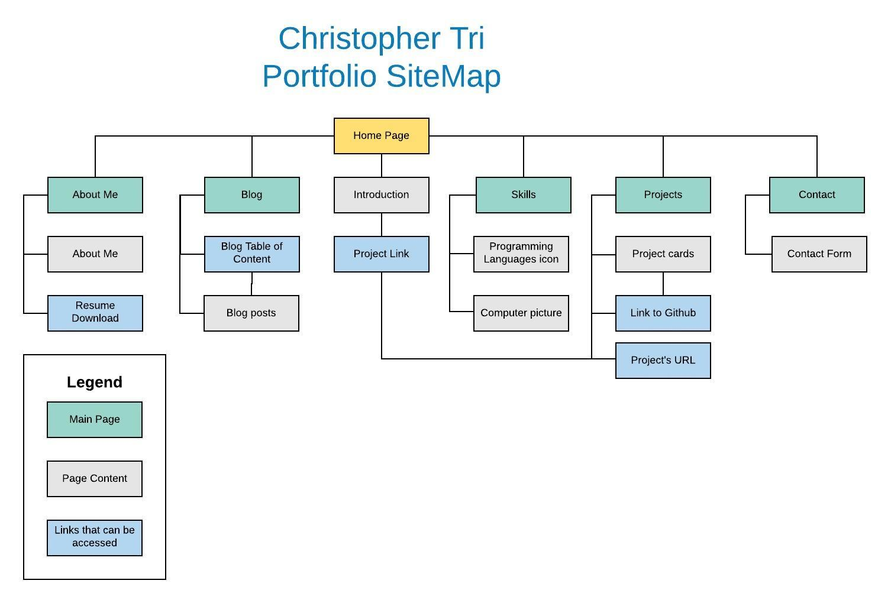
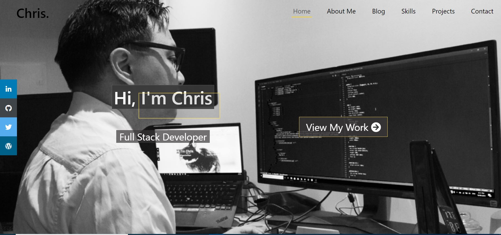
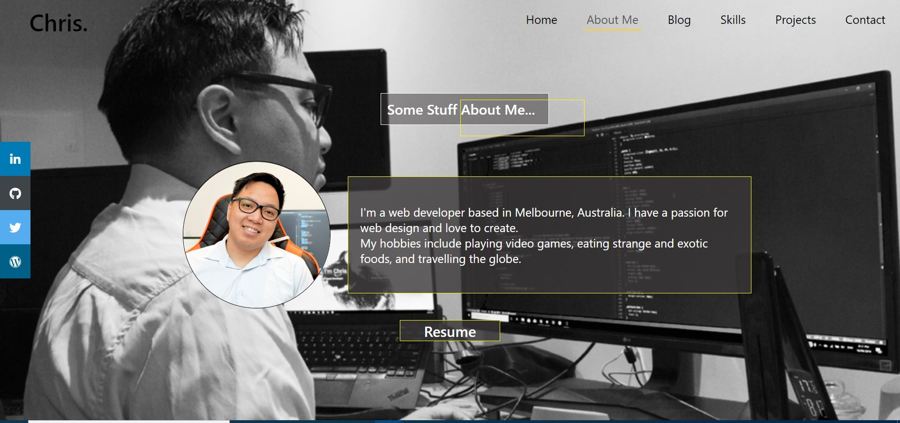
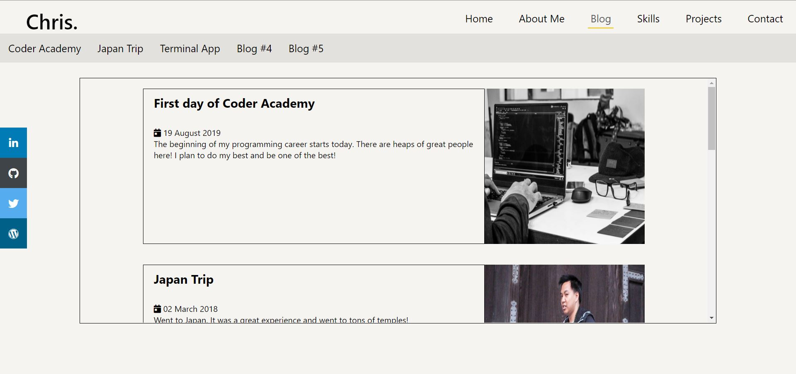
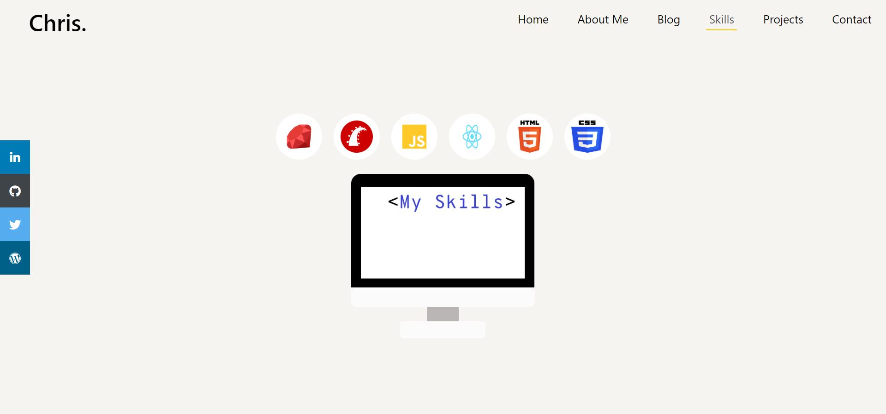
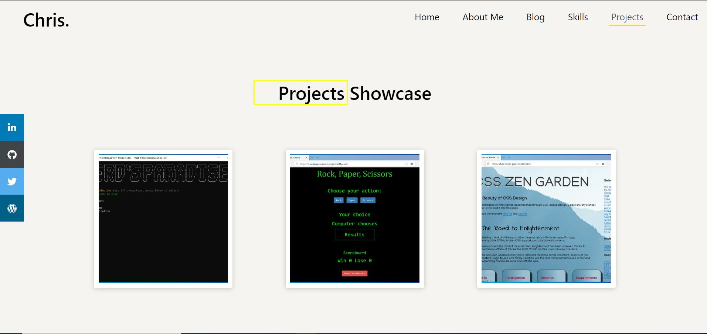
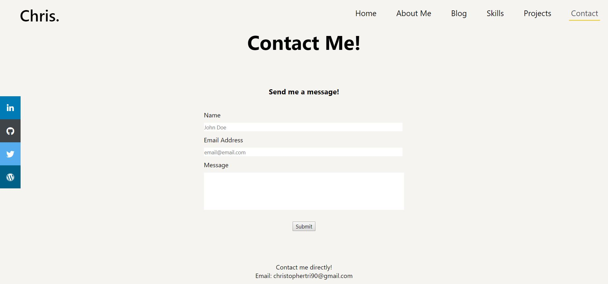
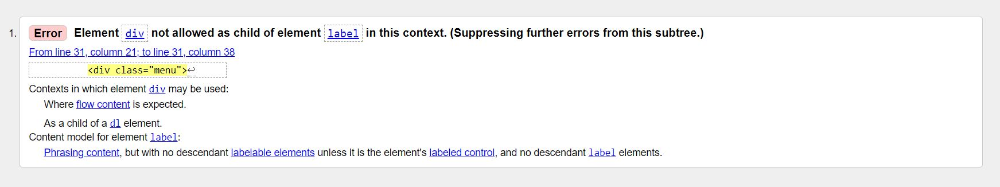

# Christopher Tri Portfolio Website

## Getting Started
### Links
Website URL: https://christopher-tri.netlify.com

Github URL: https://github.com/MomentaiChris26/Chris-Tri-Portfolio/

Dribble Mood-board URL: https://dribbble.com/CQTT/buckets/1519624-Mood-Board

# Description of the project

## Purpose

To demonstrate to potential employers my knowledge and application of HTML and CSS. Additionally, portfolio website is used to showcase my past projects.

## Target audience

The target audience for this site will be employers with some knowledge of web development. 

## SiteMap

## Screenshots

### Home Page

### About Me Page

### Blog Page

### Skills Page

### Projects Page

### Contact Page

## Functionality / Features

List of features and functionality on the site include: 
- Navigation bar is the same on all pages and provides the user an indication on which page they are on.
- Navigation bar becomes a hamburger menu when the screen shrinks below 820px for website responsiveness. 
- Home page provides a direct link to projects page. 
- Contact page is linked with email address and provides an email address for direct messages.
- Skills page uses icons to show programming languages.
- Blog is kept inside a small container for scrolling in single page view.
- Project page has clickable pictures that display links to the github or website (if applicable) when clicked. This is purely for visual effects and demonstrate some css animations.
- Certain pages have animation to improve website appeal.
- Link in about me page that downloads the pdf version of resume.

## Tech Stack
- HTML
- CSS
- Formspree
- Netlify for deployment
- Github for version control

## Known issues and other information

One issue when I ran my pages through the HTML validator was this error below.

I am fully aware of this issue and I decided not to fix the error as it related to the vital responsive hamburger menu on my site.

Normally I would have fixed this error if it was a client's website or any other website. I would have used Javascript or bootstrap to create the hamburger menu. 

However, for the assessment requirement, I decided to not change the code, and leave the error as it was the only way I knew how to create the responsive hamburger menu using just CSS. 

